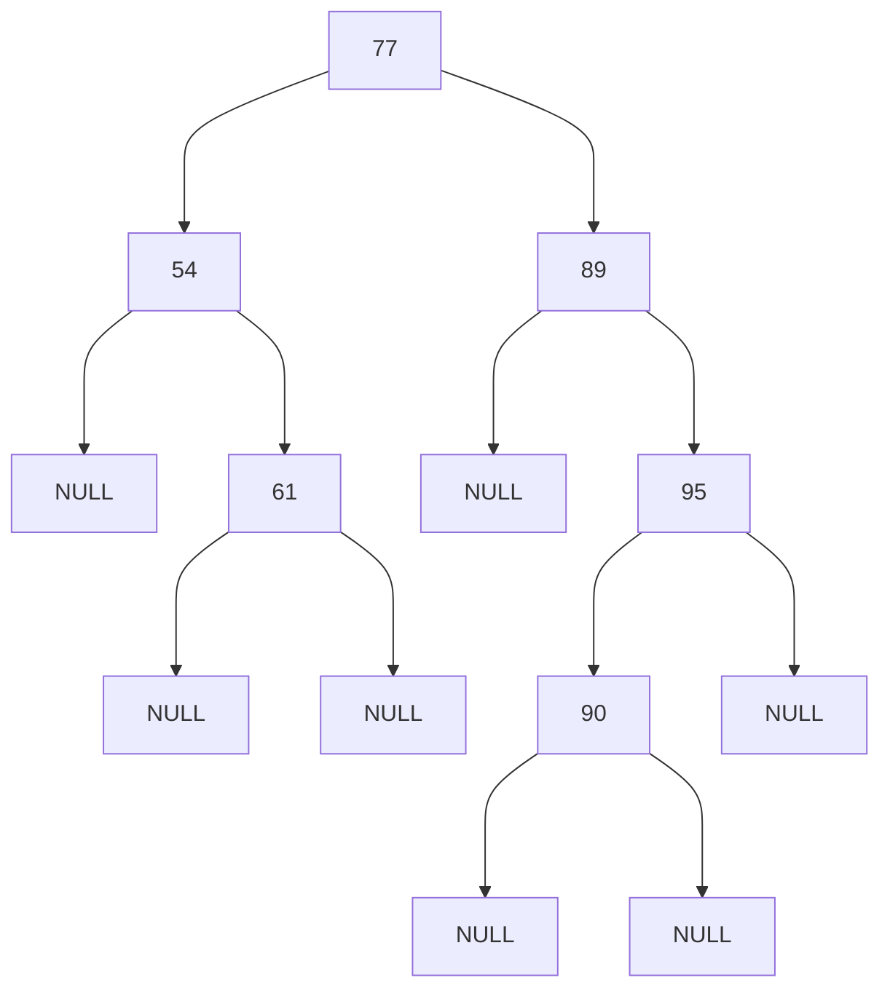

# C Programming: C Binary Search Tree
## KSAT List
This question is intended to evaluate the following topics:
- A0019: Integrate functionality between multiple software components.
- A0018: Analyze a problem to formulate a software solution.
- S0034: Declare and implement appropriate data types for program requirements.
- S0035: Declare and/or implement of arrays and multi-dimensional arrays.
- S0032: Utilize relational operators to formulate boolean expressions.
- S0033: Utilize assignment operators to update a variable.
- S0007: Skill in writing code in a currently supported programming language (e.g., Java, C++).
- S0049: Implement a recursive function.
- S0074: Find an item in a Binary Search Tree.
- S0075: Add and remove nodes from a Binary Search Tree.
- S0052: Implement a function that returns a single value.
- S0060: Create and destroy a Binary Search Tree.
- S0053: Implement a function that returns a memory reference.
- S0048: Implement a function that receives input parameters.
- S0090: Allocate memory on the heap (malloc).
- S0097: Create and use pointers.
- S0091: Unallocating memory from the heap (free).
- S0081: Implement a looping construct.
- S0108: Utilize post and pre increment/decrement operators.
- S0082: Implement conditional control flow constructs.
- S0156: Utilize a struct composite data type.

## Tasks
You will need to write functions that build a Binary Search Tree (BST) from data and safely destroy it.

### Task 1
Implement the function `buildBST` that will build the BST by:

1. Iterating the array
2. Using the provided `numNode` struct defined in TestCode.h and creating Nodes for each value in the array.
3. Inserting each Node into the BST.

**PARAMETERS:**
1. `nums`: An array of integers to place in the Binary Search Tree
2. `size`: An int representing the size of the `nums` array

**Return:** `numNode` pointer that points to the head of the tree

- No duplicate values are allowed.
- The left sub-tree of a node has a value less than its parent node's value.
- The right sub-tree of a node has a value greater than its parent node's value.
- If a value in the array is already in the BST, ignore the value and continue processing the rest of the array. 
  When complete, the function will return a pointer to the root node of the BST.

### Task 2
Implement the recursive function `destroyBST` that receives a pointer to the root node of a BST and returns the number 
of freed nodes.

**PARAMETERS:**
1. `root`: a pointer to the root node of a BST to be deleted

**Return:** int containing the number of nodes freed

- You **must** implement a recursive algorithm. The algorithm will be manually verified by the evaluator. 
- The function will visit each node in the BST and free each node, essentially deleting all nodes in the BST. 

## Binary Search Tree
An example Binary Search Tree (BST) is below; note, 77 is the root node.

## Building and Testing
To build and test your code, follow the [compile instructions](https://gitlab.com/90cos/cyv/cyber-capability-developer-ccd/ccd-master-question-file/-/blob/master/performance/exam_files/compile-instructions.md).

Be sure to check your compiler warnings and errors. Warnings often let you know when something you're doing may not be
what you intend.
